# Практические занятия по дисциплине  
**«Фронтенд и бэкенд разработка»**

## Описание проекта

В рамках практических занятий был реализован учебный проект **интернет-магазина одежды**  
(бренды: Stone Island, CP Company и др.).

Проект состоит из клиентской части (React) и серверной части (Express)  
и последовательно расширялся от практики к практике.

---

## Структура репозитория

---

## Практика 1  
**Frontend (HTML / CSS / базовая логика)**

### Выполнено:
- Сверстан интерфейс интернет-магазина
- Реализованы карточки товаров
- Добавлены изображения, названия, цены
- Единый стиль оформления страницы

### Скриншоты:
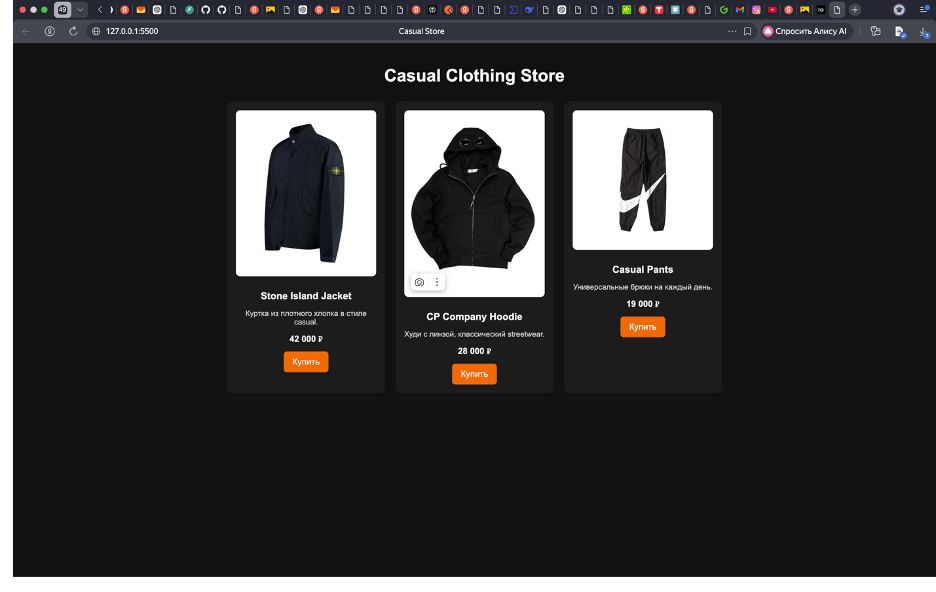

---

## Практика 2  
**Работа с данными и логикой**

### Выполнено:
- Добавлена логика работы с товарами
- Реализована обработка данных
- Подготовка структуры для дальнейшей интеграции с backend

### Скриншоты:
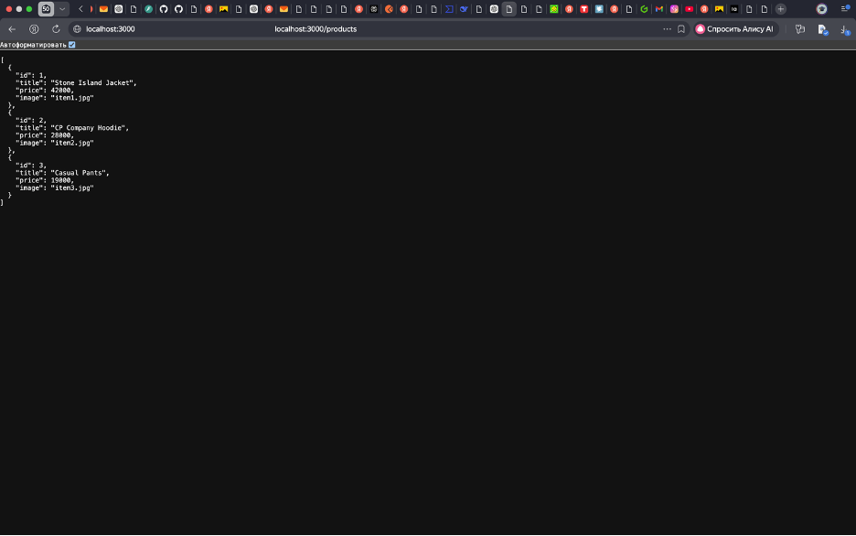
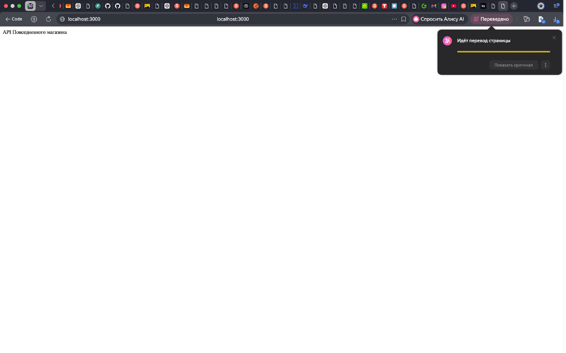

---

## Практика 3
**JSON и внешние API**

### Скриншоты:
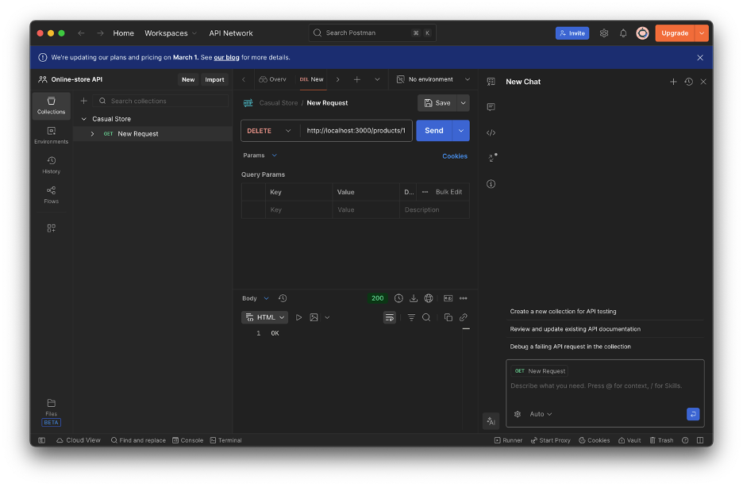
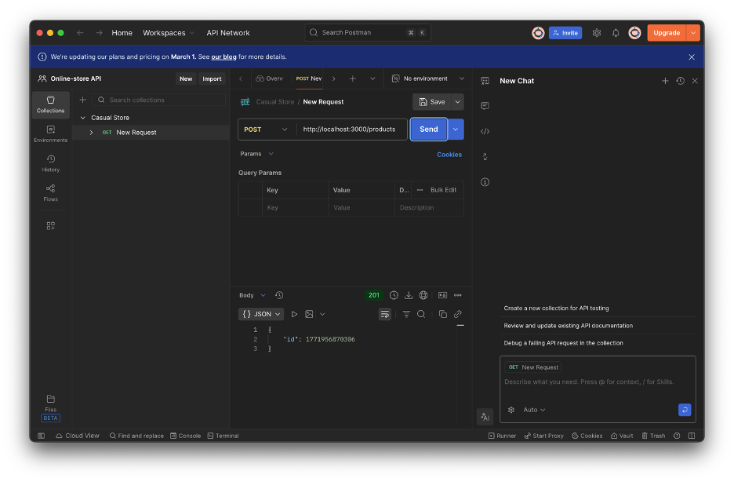
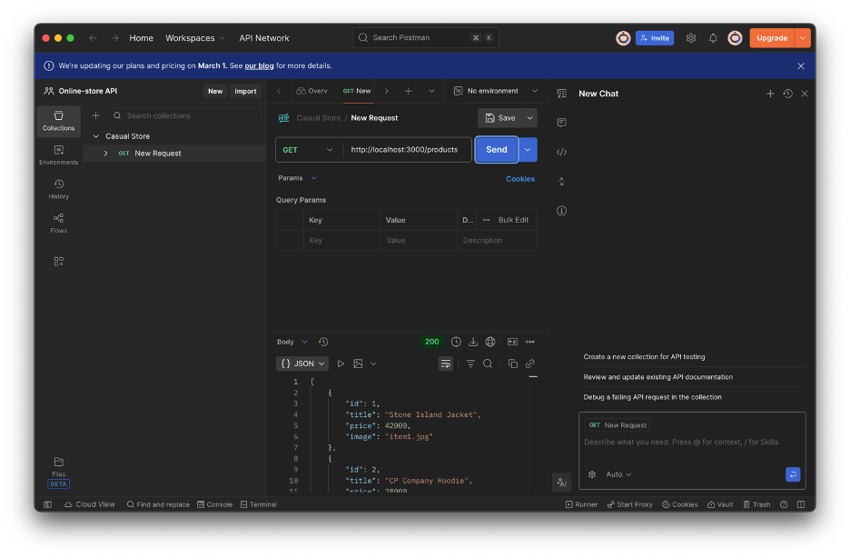

---

## Практика 4  
**React + Express (REST API)**

### Выполнено:
- Клиентская часть реализована на React
- Серверная часть реализована на Express
- Реализован REST API для товаров
- CRUD-операции:
  - Получение списка товаров
  - Создание товара
  - Обновление товара
  - Удаление товара
- Настроен CORS
- Реализовано взаимодействие frontend ↔ backend

### Используемые технологии:
- React
- Express
- Axios
- Node.js

### Скриншоты:

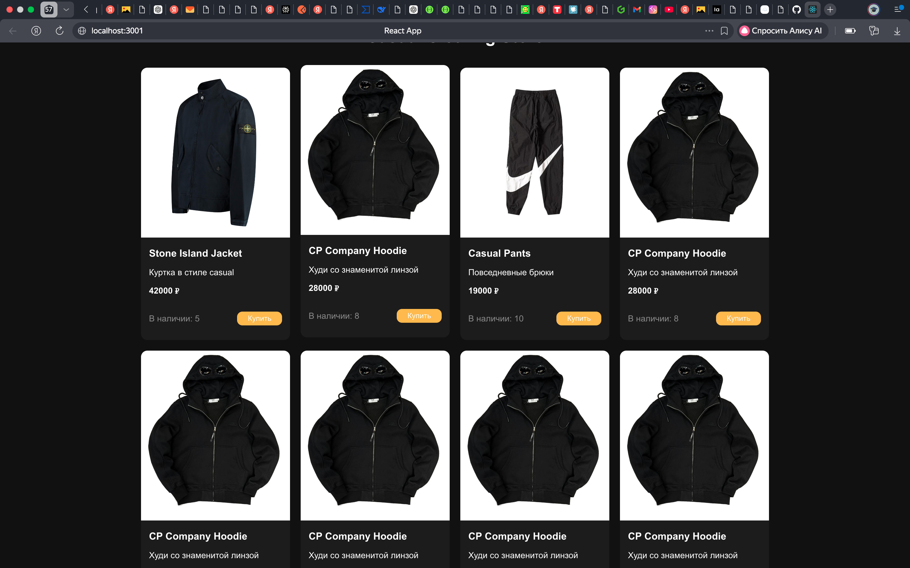
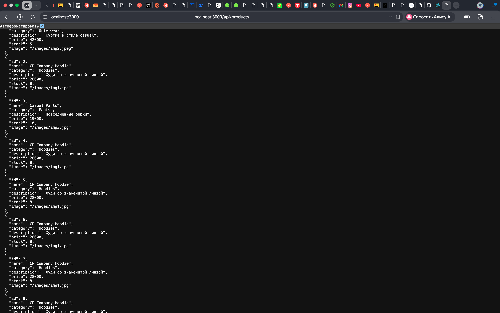

---

## Практика 5  
**Расширенный REST API + Swagger**

### Выполнено:
- Расширен backend из практики №4
- Подключены библиотеки:
  - swagger-jsdoc
  - swagger-ui-express
- Реализована автоматическая документация REST API
- Описана схема сущности `Product`
- Задокументированы все CRUD-операции:
  - GET /api/products
  - POST /api/products
  - PATCH /api/products/{id}
  - DELETE /api/products/{id}
- Swagger UI доступен по адресу:
  - http://localhost:3000/api-docs

### Проверка:
- CRUD-операции выполняются корректно
- Запросы можно отправлять через Swagger UI (Try it out)
- API возвращает реальные данные

### Скриншоты:

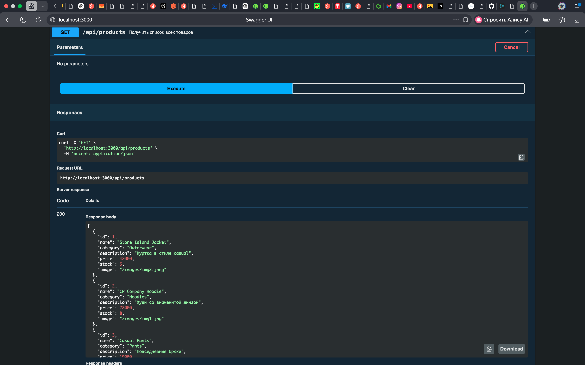
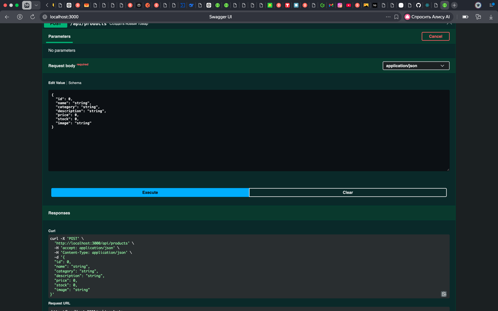
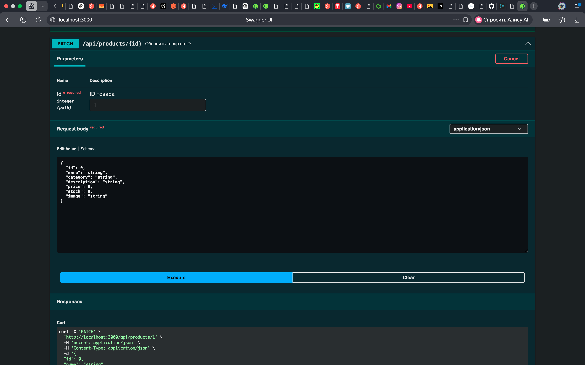
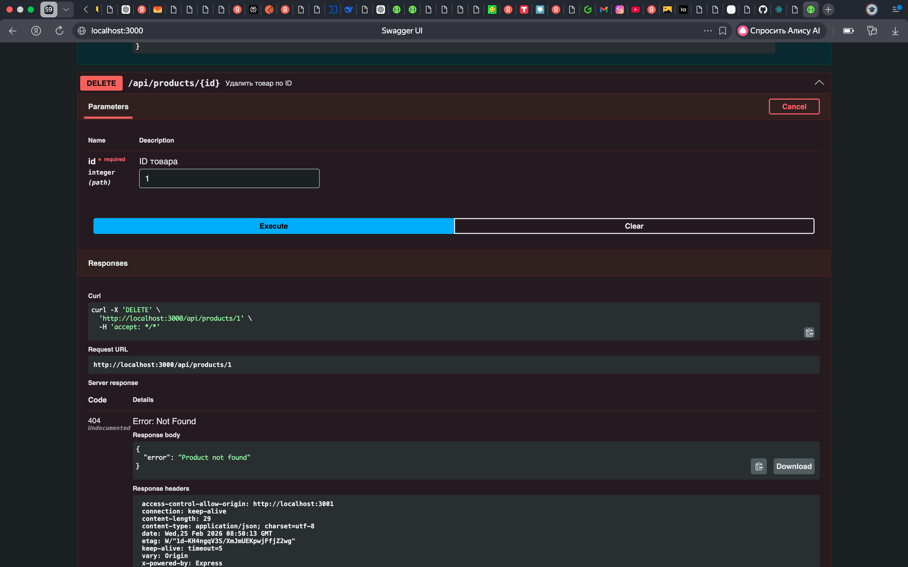