# 🛍 Frontend & Backend — Clothing Store  
## Практические занятия по дисциплине «Фронтенд и бэкенд разработка»

Институт ИПТИП  
Кафедра индустриального программирования  
4 семестр, 2025/2026 учебный год  

Тема проекта: **Интернет-магазин одежды**

---

# ✅ Практика 1 — CSS-препроцессоры (SASS)

📄 Основание: Методические указания к практическому занятию №1  

## 🎯 Цель работы  
Изучение CSS-препроцессоров (SASS/LESS) и применение:
- переменных  
- миксинов  
- вложенности  
- условных конструкций  

## 🔧 Что было реализовано

В рамках интернет-магазина реализована карточка товара с использованием SASS.

### Использованы возможности препроцессора:

✔ **Переменные (минимум 2)**  
- основные цвета проекта  
- размеры отступов  
- цвет кнопок  

✔ **Миксин (минимум 1)**  
Создан миксин для стилизации кнопки товара (фон, цвет текста, border-radius).

✔ **Вложенность селекторов**
```scss
.card {
  padding: 16px;

  &__title {
    font-size: 18px;
  }

  &__price {
    font-weight: bold;
  }

  &--accent {
    border: 2px solid $primary-color;
  }
}
```

✔ Условные конструкции (`@if`) для темы оформления  

✔ Компиляция SCSS → CSS через:
```bash
sass --watch styles.scss styles.css
```

## 📌 Результат  
Создана стилизованная карточка товара с применением возможностей CSS-препроцессора.

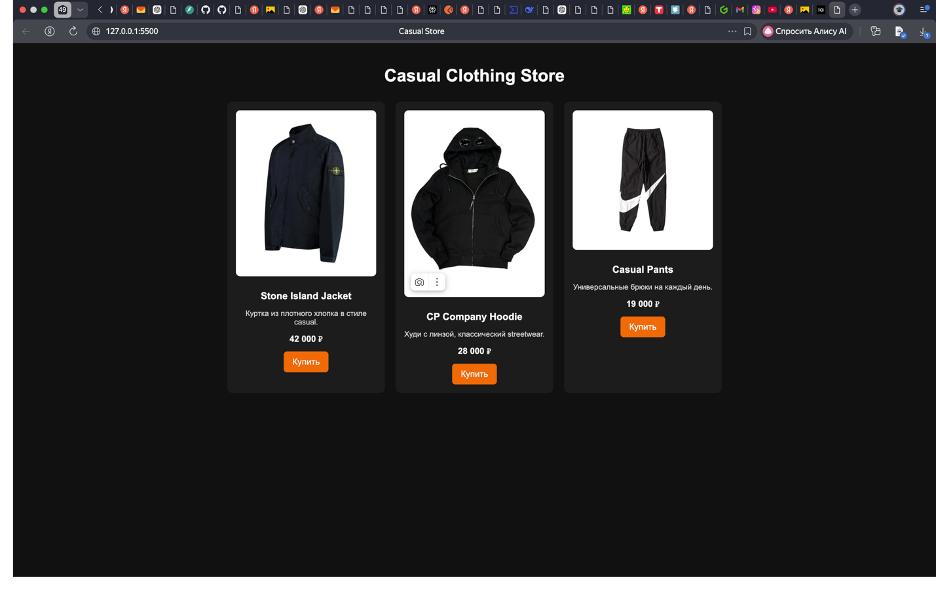

# ✅ Практика 2 — Сервер на Node.js + Express

## 🎯 Цель работы  
Создание REST API с использованием Express и реализация CRUD-операций.

## 🔧 Что реализовано

Создан сервер на **Node.js + Express**.

Подключены middleware:

✔ `express.json()` — обработка JSON  
✔ `express.urlencoded()` — обработка форм  
✔ собственное middleware для логирования запросов  

## 📦 Реализованы CRUD-операции для сущности Product

| Метод | Путь | Назначение |
|--------|--------|------------|
| GET | /products | Получение списка товаров |
| GET | /products/:id | Получение товара по ID |
| POST | /products | Создание товара |
| PATCH | /products/:id | Обновление товара |
| DELETE | /products/:id | Удаление товара |

Объект товара содержит:
- `id`
- `name`
- `price`

## 📌 Результат  
Реализован REST API с полным набором CRUD-операций.

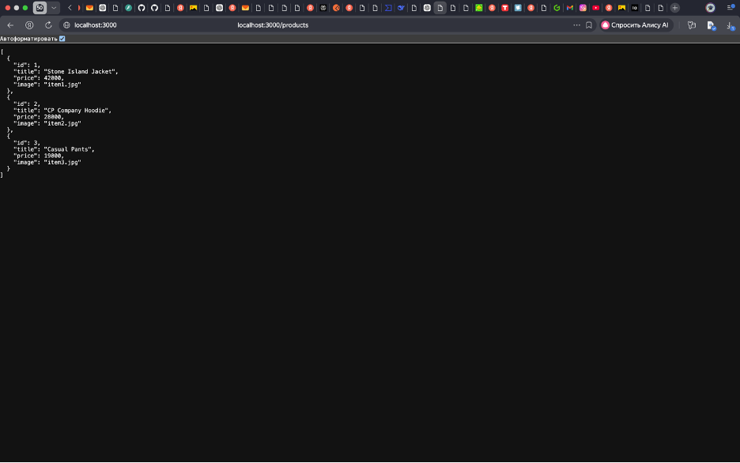
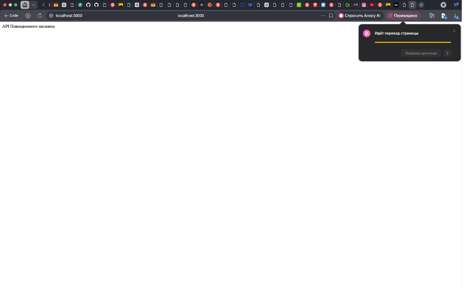

# ✅ Практика 3 — JSON и тестирование API

## 🎯 Цель работы  
Закрепить работу с JSON и тестирование API-запросов.

## 🔧 Что выполнено

✔ Отправка запросов через Postman  
✔ Проверка статусов: 200, 201, 204, 400, 404  
✔ Тестирование корректности работы CRUD-операций  

## 📌 Результат  
API корректно обрабатывает данные в формате JSON и возвращает правильные коды ответов.
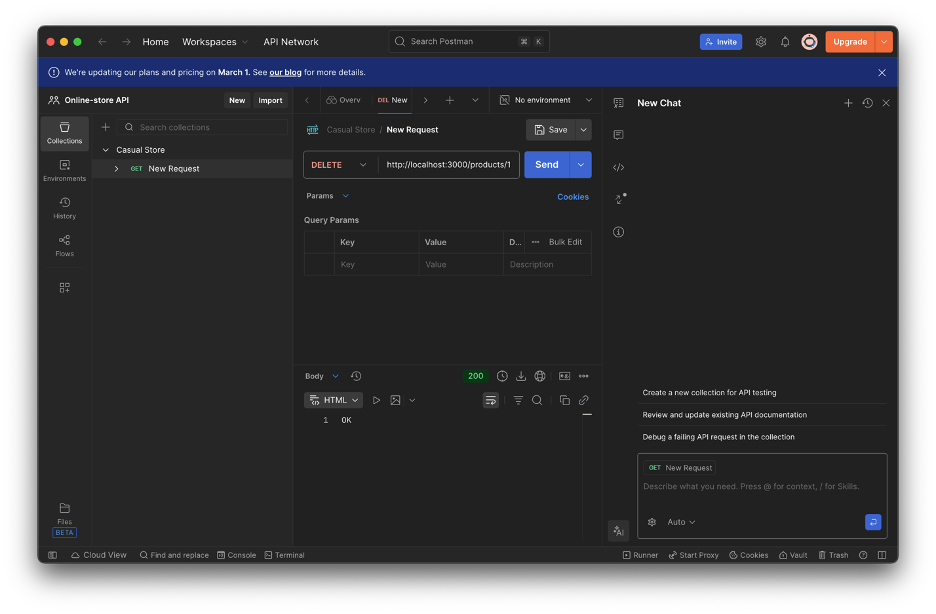
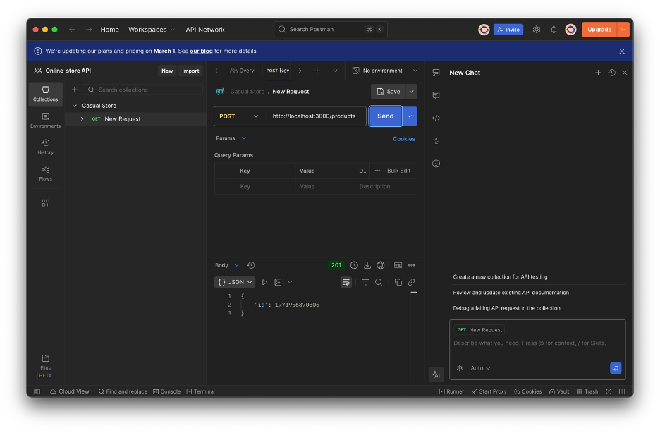
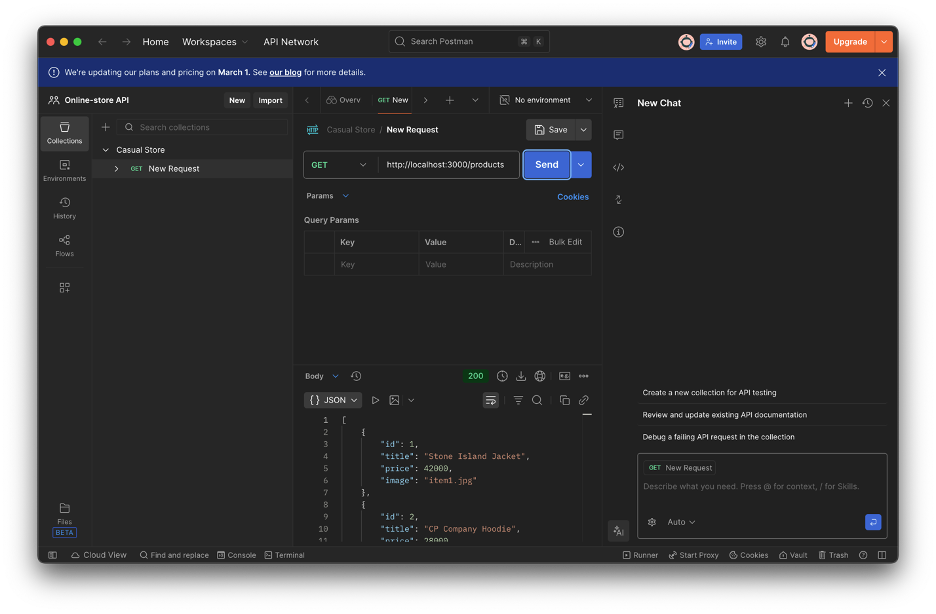
# ✅ Практика 4 — React + Express (Интернет-магазин)

## 🎯 Цель  
Связать backend API с frontend на React.

---

## 🖥 Серверная часть

✔ Подключена библиотека `nanoid` для генерации ID  
✔ Добавлен логирующий middleware  
✔ Реализованы обработчики 404 и глобальный error handler  
✔ Подключён CORS для взаимодействия с React  

---

## 🌐 Клиентская часть (React)

✔ SPA-приложение  
✔ Компоненты:
- ProductList  
- ProductItem  
- ProductModal  

✔ Использование Axios для HTTP-запросов  
✔ Динамическая загрузка товаров  
✔ Реализация CRUD через пользовательский интерфейс  

Карточка товара содержит:
- название  
- категорию  
- описание  
- цену  
- количество на складе  

## 📌 Результат  
Создано полноценное клиент-серверное приложение.


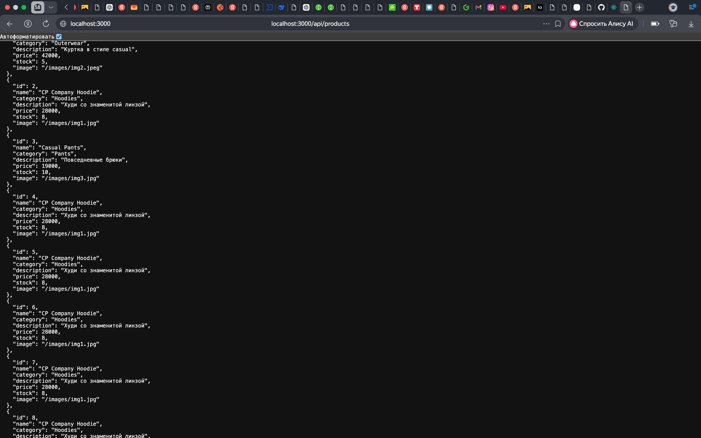
# ✅ Практика 5 — Расширенный REST API + Swagger

## 🎯 Цель  
Добавление автоматической документации API с использованием Swagger.

## 🔧 Что реализовано

✔ Подключены библиотеки:
- `swagger-jsdoc`
- `swagger-ui-express`

✔ Описана схема `Product` через JSDoc  
✔ Задокументированы все CRUD-операции:

| Метод | Путь |
|--------|--------|
| GET | /api/products |
| GET | /api/products/:id |
| POST | /api/products |
| PATCH | /api/products/:id |
| DELETE | /api/products/:id |

✔ Swagger UI доступен по адресу:
```
http://localhost:3000/api-docs
```

✔ Возможность отправки тестовых запросов через **Try it out**

## 📌 Результат  
REST API полностью документирован и соответствует стандарту OpenAPI 3.0.


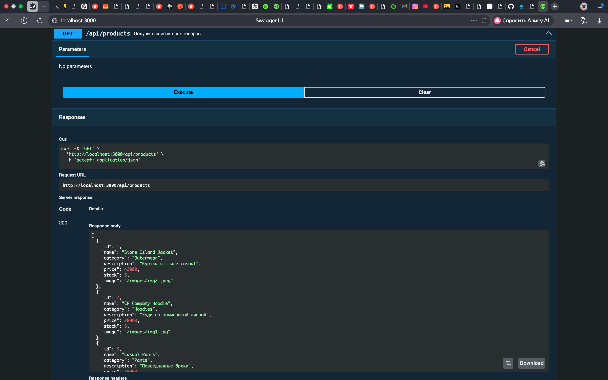
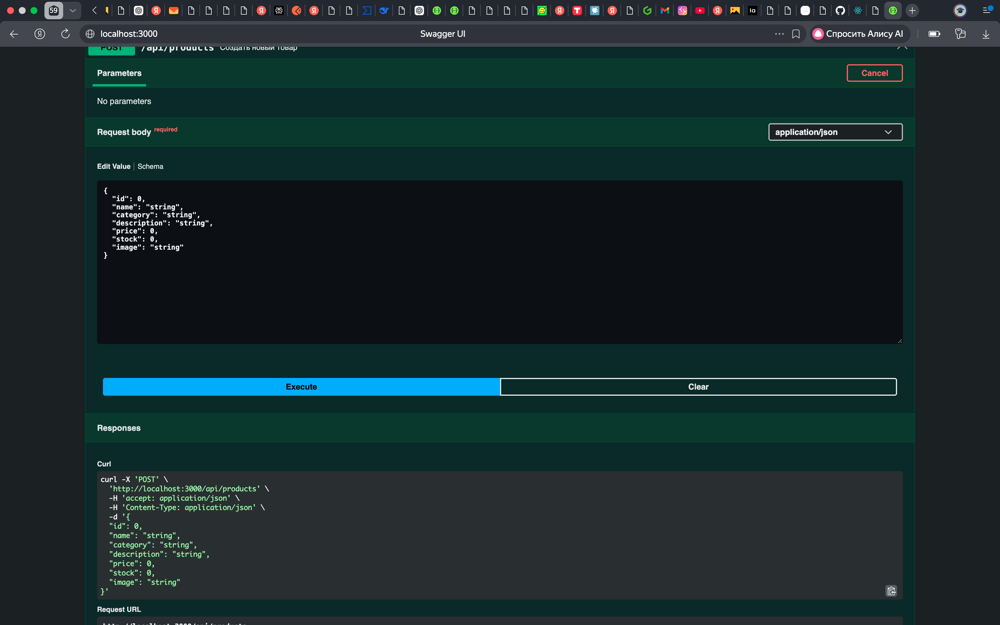
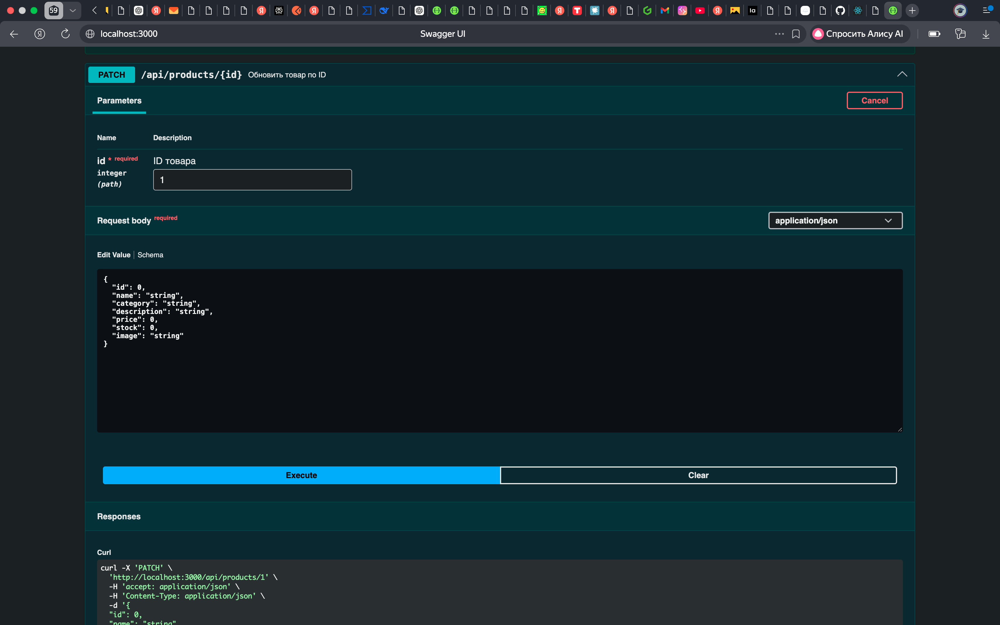
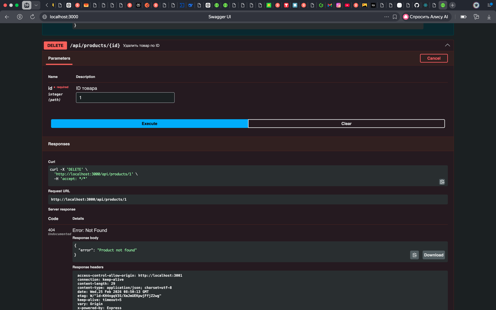
# ⭐ Практика 6 — Итоговый проект

## 🎯 Цель  
Объединить результаты всех предыдущих практических работ в единое веб-приложение.

Практика 6 представляет собой финальную сборку проекта, в которой реализованы все компоненты, разработанные в рамках предыдущих практик.

---
## 📦 Модель данных (Product)

| Поле | Тип | Описание |
|-----|-----|----------|
| id | string | Уникальный идентификатор |
| name | string | Название товара |
| description | string | Описание товара |
| price | number | Цена |
| stock | number | Количество на складе |
| image | string | Ссылка на изображение |

---

## 🔗 REST API

| Метод | Путь | Назначение |
|------|------|------------|
| GET | /api/products | Получить список товаров |
| GET | /api/products/:id | Получить товар по ID |
| POST | /api/products | Создать товар |
| PATCH | /api/products/:id | Обновить товар |
| DELETE | /api/products/:id | Удалить товар |

---

## 🚀 Запуск проекта

### Backend

```bash
cd backend
npm install
npm start
```
Сервер запускается на:

```
http://localhost:3000
```

---

### Frontend

```bash
cd frontend
npm install
npm start
```

Приложение открывается на:

```
http://localhost:3001
```

---

## 📌 Результат

В результате выполнения практической работы было разработано полноценное веб-приложение интернет-магазина одежды, включающее клиентскую и серверную части.

Проект демонстрирует полный цикл разработки современного web-приложения:

- разработка интерфейса
- создание REST API
- реализация CRUD операций
- взаимодействие frontend и backend
- документирование API через Swagger
- объединение всех компонентов в единый проект.